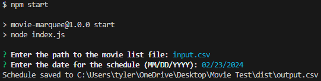
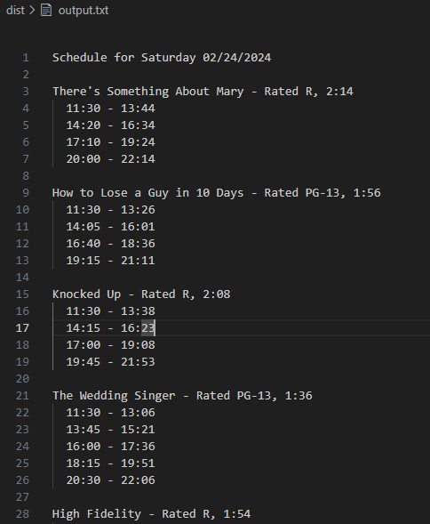

# Movie Marquee Scheduler

The Movie Marquee Scheduler is a Node.js command-line application designed to automate the process of generating showtimes for movie theaters. It replaces manual scheduling methods, offering a scalable solution for theaters to efficiently manage and display their movie showtimes.

## Features

- **CLI-Based Interaction**: Easy-to-use command-line interface for inputting movie data and generating schedules.
- **Dynamic Schedule Generation**: Automatically calculates and optimizes movie showtimes based on theater operating hours and specific business rules.
- **Output to CSV**: Generates a detailed schedule in CSV format, saved to a specified directory, making it easy to share and integrate with other systems.

## Getting Started

These instructions will guide you through setting up and running the Movie Marquee Scheduler on your local machine for development and testing purposes.

### Prerequisites

- Node.js (Version 12 or later recommended)
- npm (Usually comes with Node.js)

### Installation

1. Clone the repository to your local machine:

```bash
git clone https://github.com/TylerGeorgeAlexander/Movie-Test.git
cd movie-marquee-scheduler
```

2. Install the required dependencies:

```bash
npm install
```

3. Run the application:

```bash
node index.js
```

### Usage

When you run the application, it will prompt you to enter the path to the movie list file and the date for which you want to generate the schedule:

```
? Enter the path to the movie list file: example-input.csv
? Enter the date for the schedule (MM/DD/YYYY): 02/24/2024
```

#### Input Screenshot



After processing the input file and generating the schedule, the application will save the output to a CSV file in the `/dist` directory and display a confirmation message.

#### Output Screenshot



## Development Notes

- The scheduling logic prioritizes prime-time evening hours for movie showings, aligning with business requirements.
- Showtimes start on 5-minute intervals to facilitate easy reading and convenience for theater-goers.
